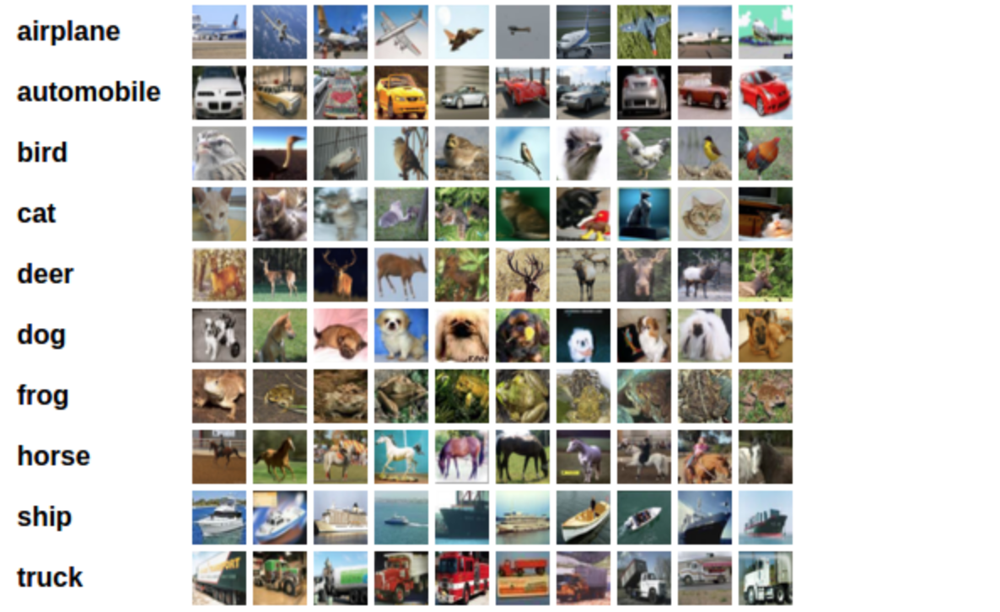

### Classify CIFAR-10 Using CNN

### Description
In this project, we train a **CNN** to classify images from the CIFAR-10 database.
The images in this database are small color images that fall into one of ten classes; some example images are pictured below.

The process will be broken down into the following steps:
1. Load, Augment and Visualize the data
2. Define a Convolutional Neural Network
3. Define Optimizer and Loss function
3. Train the model
4. Evaluate the performance of our trained model on a test dataset

### Data
CIFAR-10  is an established computer-vision dataset used for object recognition.
It is a subset of the 80 million tiny images dataset and consists of 60,000 32x32 color images 
containing one of 10 object classes, with 6000 images per class. It was collected by Alex Krizhevsky,
Vinod Nair, and Geoffrey Hinton.

There are 50,000 training images and 10,000 test images in the official data. We have preserved the
train/test split from the original dataset.

The label classes in the dataset are:

0. airplane 
1. automobile 
2. bird 
3. cat 
4. deer 
5. dog 
6. frog 
7. horse 
8. ship 
9. truck

The classes are completely mutually exclusive. There is no overlap between automobiles and trucks.
"Automobile" includes sedans, SUVs, things of that sort. "Truck" includes only big trucks.
Neither includes pickup trucks.
